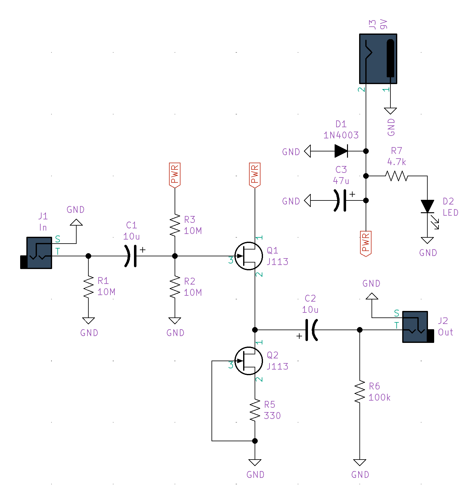
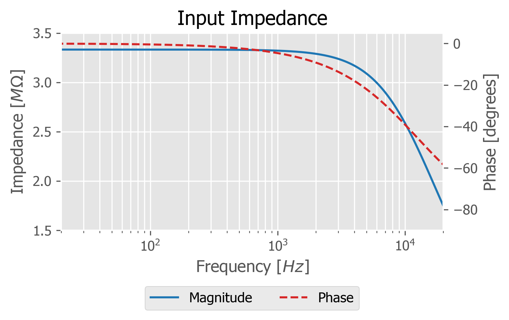

# JFET Buffer

This project documents the design and construction of a JFET buffer guitar pedal.

## BOM
|Quantity |Designators |Description         |Value         |Package |Mouser Part #       |
|:--------|:-----------|:-------------------|:-------------|:-------|:-------------------|
|3        |R1, R2, R3  |Resistor            |10Mohm, 1/8W  |3.6mm   |594-5063JD10M00FT   |
|1        |R 5         |Resistor            |330ohms, 1/8W |3.6mm   |603-MFR-12FTF52-330R|
|1        |R6          |Resistor            |100Kohms, 1/8W|3.6mm   |603-CFR-12JT-52-100K|
|1        |R7          |Resistor            |4.7Kohms, 1/8W|3.6mm   |603-MFR-12FTF52-4K7 |
|2        |C1, C2      |Capacitor, polarized|10uF, 16V     |4mm     |647-USW1C100MDD     |
|1        |C3          |Capacitor, polarized|47uF, 25V     |5mm     |647-UFW1E470MDD     |
|2        |Q1, Q2      |N-Channel JFET      |J113          |TO-92   |512-J113            |
|1        |D1          |Diode               |1N4003        |DO-41   |583-1N4003-T        |
|1        |D2          |LED                 |Green         |5mm     |859-LTL2R3KGD-EM    |
|2        |J1, J2      |Phone Connector     |1/4" TS       |        |568-NYS229          |
|1        |J3          |DC Power Connector  |2.1mm         |        |163-1060-EX         |

## Design

The circuit consists of a JFET source follower with an active load. Compared to passive biasing, an active load provides an operating point that is stable over a much larger range of voltages. This allows the amplifier to drive lower impedance loads at lower supply voltages.

## Simulation Results
The following simulations were conducted in LTspice. For the schematic file and simulation results, [see the simulation folder.](./simulation)

### Input Impedance 
A high input impedance is necessary to avoid loading passive guitar pickups. Generally, an input impedance of at least 1 MΩ is desired. The design provides this impedance throughout the audio range.

### Output Impedance
The design provides a low enough output impedance to drive line-level inputs. While the coupling capacitor dominates at low frequencies, the output impedance asymptotes to 100 Ω, which is more than sufficient for instrument level applications.

### Gain
A good voltage buffer has as close to a gain of 1 as possible. Due to the higher impedance of the active load, the design comes within 0.1 dB of this.

### Power Supply Rejection
The design has a PSRR of -43dB at DC, and the power supply capacitor further filters supply noise at high frequencies.

### Noise
Noise simulation results in 171.18 nV in the audio range. Even if actual circuit noise is many times worse, it will be negligible compared to other noise sources in the signal chain.

